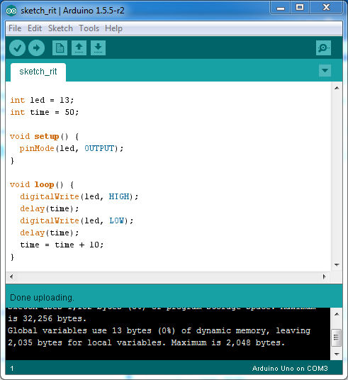

#  Klasse 1

## Arduino

[Arduino software Download](https://www.arduino.cc/en/Main/Software)

## Arduino Uno
[Arduino Uno Webseite](https://www.arduino.cc/en/Main/ArduinoBoardUno)

Arduino Uno is a **microcontroller** board based on the ATmega328P. It has 14 digital input/output pins (of which 6 can be used as PWM outputs), 6 analog inputs, a 16 MHz quartz crystal, a USB connection, a power jack, an ICSP header and a reset button. It contains everything needed to support the microcontroller; simply connect it to a computer with a USB cable or power it with a AC-to-DC adapter or battery to get started.. You can tinker with your UNO without worrying too much about doing something wrong, worst case scenario you can replace the chip for a few dollars and start over again. "Uno" means one in Italian and was chosen to mark the release of Arduino Software (IDE) 1.0.

## Mikrokontroller?

Als Mikrocontroller (auch µController, µC, MCU) werden Halbleiterchips bezeichnet, die einen Prozessor und zugleich auch Peripheriefunktionen enthalten. In vielen Fällen befindet sich auch der Arbeits- und Programmspeicher teilweise oder komplett auf demselben Chip. Ein Mikrocontroller ist ein **Ein-Chip-Computersystem**.

### Hersteller
[Microschip Technology](http://www.microchip.com)  
[Texas Instruments](https://www.ti.com)

### Steckplatine/Breadboard
[Steckplatine wiki](http://de.wikipedia.org/wiki/Steckplatine)

### Sketch1

- blinkende LED

#### mit einer externen LED

### Sketch2

- mit Variable

### Sketch3

- rit...

### Sketch4

- rit und accel

### Sketch5

- randomisierten Intervalle

### Sketch6

- Serial.println

- tools -> Serial Monitor

### Sketch7

- random + serial monitor

- serial monitor

### Sketch8

- einfache Mathematik in Arduino

### Sketch9

- Schalter und Serial

### Sketch10

- "serial" Objekt in Max

- max patch

### Sketch11

- Aufgabe: Programmieren Sie das folgende System mit einem Arduino, einer LED und einem Schalter.

---

1. Wenn der Schlater ein ist, blinkt die LED aller 0,2 Sekunden.
2. Wenn der schalter aus ist, blinkt die LED gar nicht.

---

### Sketch12

- Max steuert die LED

- max patch

### Sketch13

- das Blinken als Klang

---
## Mikrokontroller Musiker

[Tristan Perich 1-bit- Symphony](http://www.1bitsymphony.com)

[Arduino Synth](http://playground.arduino.cc/Main/ArduinoSynth#.UyrtjN6h_JE)

[Mozzi sound synthesis library for Arduino](http://sensorium.github.io/Mozzi/)
