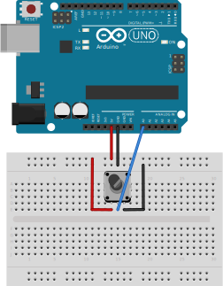

# Klasse 2

## Arduino

### ADC = Analog to Digital Converter

- Arduino Uno hat 6 x 10bit ADCs 
- Auflösung 10 bit = 0 - 1023
	- 0 ... 0 Volt
	- 512 ... 2.5 Volt
	- 1023 ... 5 Volt
- A0 - A5 ... Analog In

- Serial.write kann nur ein Byte (8bit) auf einmal übertragen, deshalb muss man mit /4 skalieren.

---

### Sketch1

#### voltage divider
  

- [voltage divider wiki](http://de.wikipedia.org/wiki/Spannungsteiler)

- voltage divider 2x 220 Ohm 
- [Widerstandfarbcode](https://www.elektronik-kompendium.de/sites/bau/1109051.htm)

	Z1 = 220  
	Z2 = 220  
	220/(220+220) = 0.5  
	0.5 * 255 = ca' 127  

---

### Sketch2

- voltage divider 220 Ohm und 68 Ohm

	Z1 = 220  
	Z2 = 68  
	68/(220+68) = 0.2361  
	0.2361 * 255 = ca' 60  

---

### Sketch3

- Potentiometer

---

### Sketch4

- Force Sensitive Register(FSR)
- Infrarotsensor
- Lichtsensor

---

### Sketch5
- Infrarotsensor

---

### Sketch6

- Photocell
- 

