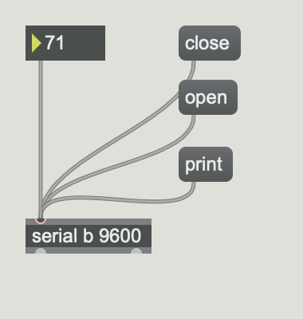

# Klasse 3

## PWM (Pulse Wave Modulation) mit Arduino

Pulse Width Modulation, or PWM, is a technique for getting analog results with digital means. 


Frequenz = ca' 500 Hz

  
Pins mit ~ (Tilde) kann man als PWM pin benutzen.

### LED Helligkeitssteuerung mit PWM

```
int ledPin = 9;     

void setup()
{
  pinMode(ledPin, OUTPUT); 
}

void loop()
{
  analogWrite(ledPin, 10);
  //analogWrite(ledPin, 40);
  //analogWrite(ledPin, 250);
}
```


### Breathing Light Effect

```
int ledPin = 9;     
int val = 0;
int add = 1;

void setup()
{
  pinMode(ledPin, OUTPUT); 
}

void loop()
{
  
  analogWrite(ledPin, val);
  val += add;

  if(val == 255)
    add = -1;
  if(val == 0)
    add = 1;

  delay(10);
}
```


### mit Lautsprecher


## Abstand steuert die Helligkeit ( Infrarot - Arduino - LED)

```
int ledPin = 9;  
int sensorPin = 0;   

void setup()
{
  pinMode(ledPin, OUTPUT); 
}

void loop()
{
  int input = analogRead(0) - 300; // offset value 
  input = max(0, input); // no negative value
  analogWrite(ledPin, input / 2); // 0 - 255
}
```
	

## Max steurt die Helligkeit ( Max - Arduino - LED )


```
int ledPin = 9;

void setup()
{
  Serial.begin(9600);
}

void loop()
{
  if(Serial.available())
  {
    int value = Serial.read();
    analogWrite(ledPin, value);
  }
}
```



## Poti steuert SERVO ( Poti - Arduino - Servo )   

```
#include <Servo.h>

Servo myservo; 

int potpin = 1;  
int val; 

void setup()
{
    myservo.attach(9); 
}

void loop()
{
    val = analogRead(potpin);           
    val = map(val, 0, 1023, 0, 179);    
    myservo.write(val);                  
    delay(15);                           
}
```


[Bear Drummer](https://www.youtube.com/watch?v=21lY4aIEkT0)
