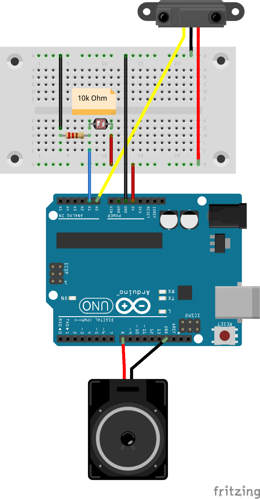

# Klasse 4

## Arduino Theremin


### Schritt 1

Infrarot Sensor Steuert die Frequenz von Rechteck.

```
int speaker = 8;

void setup()
{
    pinMode(speaker, OUTPUT);
}

void loop()
{
    int delayTime = analogRead(A0) / 64;

    digitalWrite(speaker, 1);
    delay(delayTime);
    digitalWrite(speaker, 0);
    delay(delayTime);
}
```

### Schritt 2

Mit delayMicroseconds

```

int speaker = 8;

void setup()
{
    pinMode(speaker, OUTPUT);
}

void loop()
{
    int delayTime = analogRead(A0) * 4;

    digitalWrite(speaker, 1);
    delayMicroseconds(delayTime);
    digitalWrite(speaker, 0);
    delayMicroseconds(delayTime);
}
```

zu viel Geräusch

### Schritt 3

Mit LPF

```

int speaker = 8;
int previousValue;
void setup()
{
    pinMode(speaker, OUTPUT);
}

void loop()
{
    int delayTime = analogRead(A0) * 4;

    delayTime = (delayTime - previousValue) * 0.1 + previousValue;
    digitalWrite(speaker, 1);
    delayMicroseconds(delayTime);
    digitalWrite(speaker, 0);
    delayMicroseconds(delayTime);

    previousValue = delayTime;
}
```

### Schritt 4

Photocell für Klangfarbesteuerung



```

int speaker = 8;
int previousValue;

void setup()
{
    pinMode(speaker, OUTPUT);
}

void loop()
{
    int delayTime = analogRead(A0) * 4;
    float timbre = (float)analogRead(A1);
    float ratio = timbre / 1024.0;
    
    delayTime = ((delayTime - previousValue) * 0.1 + previousValue) * 2;

    digitalWrite(speaker, 1);
    delayMicroseconds(delayTime * ratio);
    digitalWrite(speaker, 0);
    delayMicroseconds(delayTime * (1.0 - ratio));

    previousValue = delayTime;
}
```


