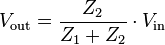
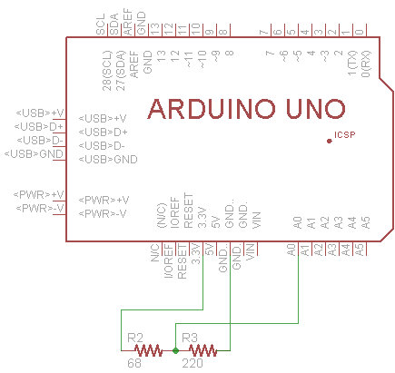
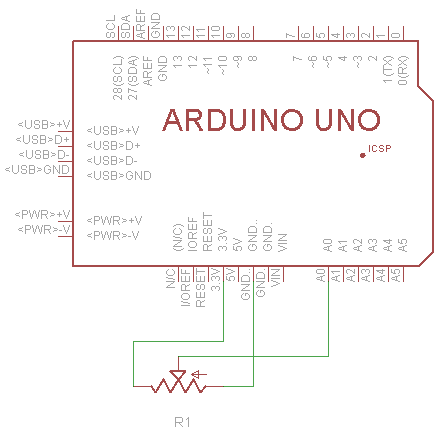
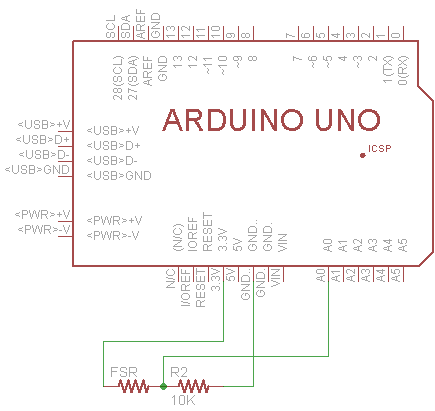
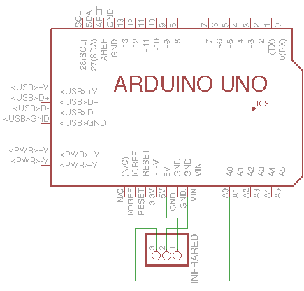

# Klasse 3

## Arduino

### ADC = Analog to Digital Converter

- Arduino Uno hat 6 x 10bit ADCs 
- Auflösung 10 bit = 0 - 1023
	- 0 ... 0 Volt
	- 512 ... 2.5 Volt
	- 1023 ... 5 Volt
- A0 - A5 ... Analog In

- Serial.write kann nur ein Byte (8bit) auf einmal übertragen, deshalb muss man mit /4 skalieren.

---

### Sketch1

#### voltage divider

- [voltage divider wiki](http://de.wikipedia.org/wiki/Spannungsteiler)

  

- voltage divider 2x 220 Ohm 
- [Widerstandfarbcode](https://www.elektronik-kompendium.de/sites/bau/1109051.htm)

  

	Z1 = 220  
	Z2 = 220  
	220/(220+220) = 0.5  
	0.5 * 255 = ca' 127  

---

### Sketch2

- voltage divider 220 Ohm und 68 Ohm

  

	Z1 = 220  
	Z2 = 68  
	68/(220+68) = 0.2361  
	0.2361 * 255 = ca' 60  

---

### Sketch3

- 68 Ohm --> 220 Ohm  

  

	Z1 = 68  
	Z2 = 220  
	220/(220+68) = 0.7638  
	0.2361 * 255 = ca' 195 

---

### Sketch4

- potentiometer

Potentiometer ist ein Art von Voltage-Divider

---

### Sketch5

- Force Sensitive Register(FSR)
- Bendsensor
- Lichtsensor

---

### Sketch6
- Infrarotsensor

---

### Sketch7

Aufgabe: Erzeugen Sie einen Ton (Viereck) von Arudion mit einem Lautsprecher und steuern Sie die Frequenz des Tons mit
einem FSR, Lichtsensor.

