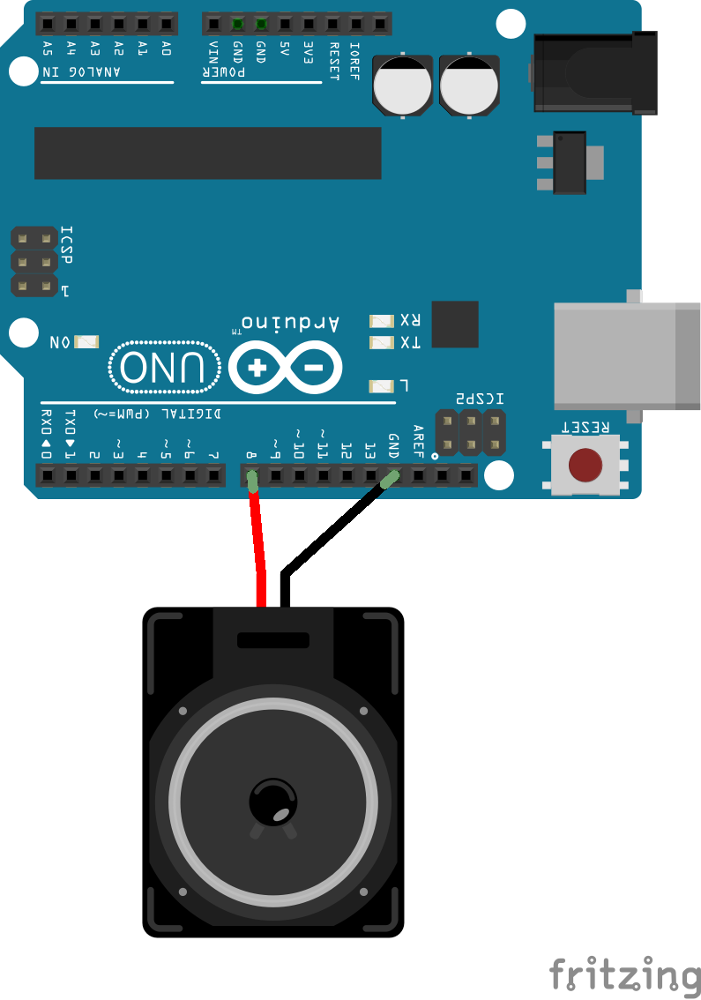
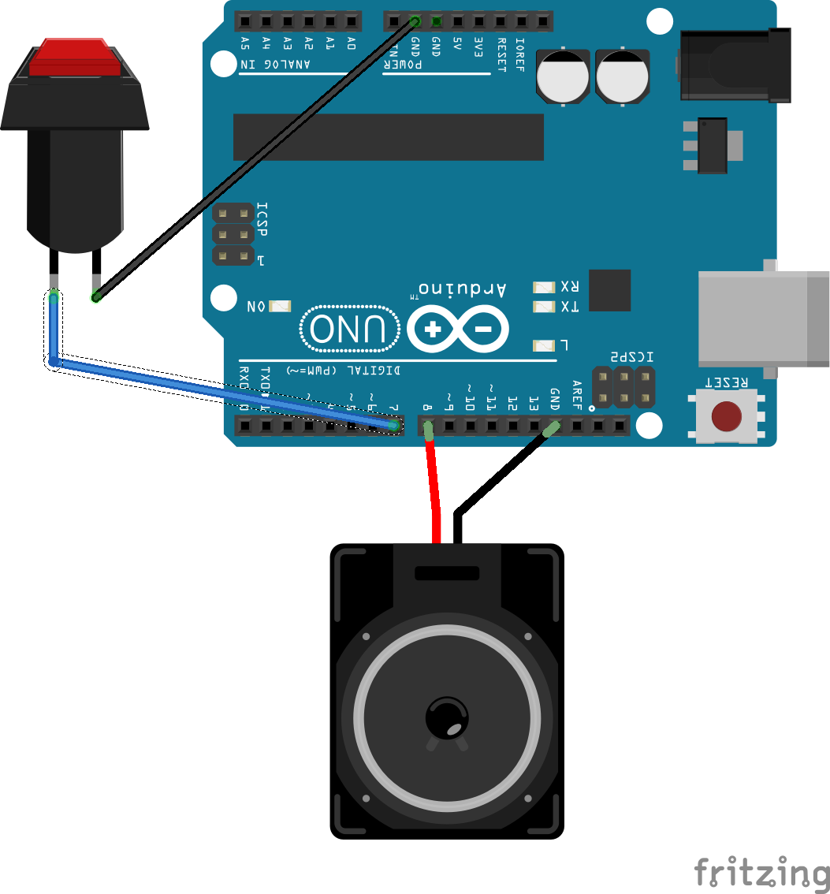

# Klasse 4

## Arduino Theremin


### Schritt 1

Infrarot Sensor Steuert die Frequenz von Rechteck.

```
int speaker = 8;

void setup()
{
    pinMode(speaker, OUTPUT);
}

void loop()
{
    int delayTime = analogRead(A0) / 64;

    digitalWrite(speaker, 1);
    delay(delayTime);
    digitalWrite(speaker, 0);
    delay(delayTime);
}
```

### Schritt 2

Mit delayMicroseconds

```

int speaker = 8;

void setup()
{
    pinMode(speaker, OUTPUT);
}

void loop()
{
    int delayTime = analogRead(A0) * 4;

    digitalWrite(speaker, 1);
    delayMicroseconds(delayTime);
    digitalWrite(speaker, 0);
    delayMicroseconds(delayTime);
}
```

zu viel Geräusch

### Schritt 3

Mit LPF

```

int speaker = 8;
int previousValue;
void setup()
{
    pinMode(speaker, OUTPUT);
}

void loop()
{
    int delayTime = analogRead(A0) * 4;

    delayTime = (delayTime - previousValue) * 0.1 + previousValue;
    digitalWrite(speaker, 1);
    delayMicroseconds(delayTime);
    digitalWrite(speaker, 0);
    delayMicroseconds(delayTime);

    previousValue = delayTime;
}
```

### Schritt 4

Photocell für Klangfarbesteuerung


```

int speaker = 8;
int previousValue;

void setup()
{
    pinMode(speaker, OUTPUT);
    Serial.begin(9600);
}

void loop()
{
    int delayTime = analogRead(A0) * 4;
    int timbre = analogRead(A1);

    if(timbre < 150) // dark == mute
      return;

    float ratio = timbre / 1024.0;

    delayTime = (delayTime - previousValue) * 0.1 + previousValue;
    digitalWrite(speaker, 1);
    delayMicroseconds(delayTime * ratio);
    digitalWrite(speaker, 0);
    delayMicroseconds(delayTime * (1.0-ratio));

    previousValue = delayTime;
}

```

## Arduino Snare Drum

### Schritt 1


Fake noise

```
int speaker = 8;
int maxTime = 500;

void setup()
{
    pinMode(speaker, OUTPUT);
}

void loop()
{
    digitalWrite(speaker, 1);
    delayMicroseconds(random(maxTime));
    digitalWrite(speaker, 0);
    delayMicroseconds(random(maxTime));
}
```

### Schritt 2

Note on/off

```
int speaker = 8;
int maxTime = 500;
unsigned long sum = 0;

void setup()
{
    pinMode(speaker, OUTPUT);
}

void loop()
{
    while(sum < 50000)
    {
      digitalWrite(speaker, 1);
      delayMicroseconds(generateRandom());
      digitalWrite(speaker, 0);
      delayMicroseconds(generateRandom());
    }
    delay(500);
    sum = 0;
}
```

### Schritt 3



Button trigger

```
int button = 7;
int speaker = 8;
int maxTime = 500;

void setup()
{
    pinMode(button, INPUT); 
    pinMode(speaker, OUTPUT);
    digitalWrite(button, 1);
}

void loop()
{
    if(digitalRead(button) == 0)
    {
        digitalWrite(speaker, 1);
        delayMicroseconds(random(maxTime));
        digitalWrite(speaker, 0);
        delayMicroseconds(random(maxTime));
    }
}
```
